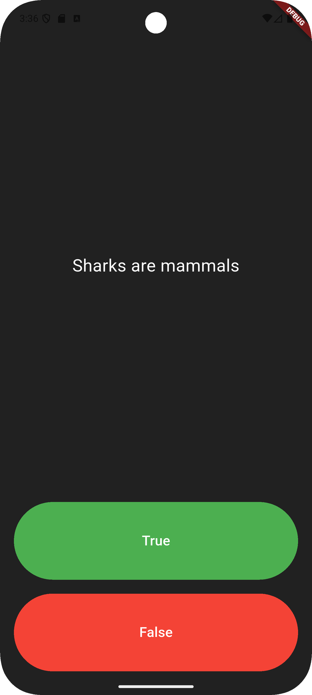

# 🎯 Quiz App

A simple and engaging Flutter-based quiz application where users answer multiple-choice questions and view results at the end.

 

---

## 📱 Features

- ✨ Beautiful and responsive UI
- 🧠 Multiple-choice questions
- 📊 Result summary with score display
- 🔄 Quiz restart option
- 🖼️ Custom images and assets

---

## 🚀 Getting Started

### Prerequisites

- Flutter SDK installed: [Get Flutter](https://docs.flutter.dev/get-started/install)
- Android Studio / VSCode with Flutter extensions

### Run the App

```bash
git clone https://github.com/AlinsBinuP/Quiz-App.git
cd Quiz-App
flutter pub get
flutter run
```

---

## 🧩 Project Structure

```
lib/
│
├── data/               # Quiz questions
├── models/             # Question model (optional improvement)
├── screens/            # Start, Question, Result screens
├── widgets/            # Reusable UI components like AnswerButton
└── main.dart           # Entry point
```

---

## 🖼️ Screenshots

| Start Screen |  Result Screen |
|--------------|-----------------|---------------|
|  | ! |

> Replace image paths with your actual assets or links to hosted screenshots.

---

## 🛠️ Built With

- [Flutter](https://flutter.dev/)
- Dart
- Android Studio

---

## 🙌 Contributions

Contributions, issues, and feature requests are welcome!  
Feel free to fork this repo and submit a pull request.

---

## 📄 License

This project is licensed under the MIT License - see the [LICENSE](LICENSE) file for details.

---

## 👤 Author

- **Alins Binu**  
  [GitHub](https://github.com/AlinsBinuP) • [LinkedIn](https://www.linkedin.com/in/alins-binu-4351b6292/)
